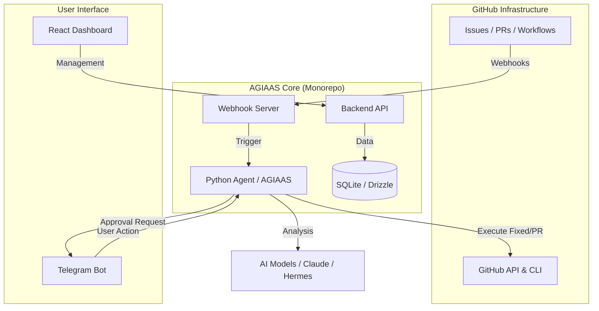

<p align="center">
  
</p>

# 🦊 AGIAAS - Autonomous Agent Platform

[](https://opensource.org/licenses/MIT)
[](#-tech-stack)
[](#)

> **Intelligent Incident Management & On-Call Agent System**

AGIAAS (Autonomous GitHub Incident Analysis & Automation System) is a powerful **intelligent agent platform** that monitors your GitHub infrastructure, analyzes anomalies using state-of-the-art AI, and facilitates automated fixes via a Telegram-integrated human-in-the-loop workflow.

---

## 🚀 Key Features

- **🎯 Proactive Monitoring:** Real-time tracking of GitHub Issues, PRs, and Workflow failures.
- **🧠 Brain Layer:** Leverage Claude-3.5-Sonnet or Hermes-Llama for deep root-cause analysis.
- **📱 Human-in-the-Loop:** Interactive approval flow via Telegram bots—you decide, AI executes.
- **🛠️ Autonomous Fixes:** Automated branch creation, code patching, and PR generation.
- **⏪ CI/CD Rollback:** One-tap rollback to the last successful workflow run when a failure is detected.
- **💰 Cost Transparency:** Real-time token usage and cost calculation for every operation.
- **📡 Webhook Automation:** Zero-config webhook synchronization using Cloudflare tunnels.

---

## 🔄 System Architecture



---

## 🔌 Project Structure

This is a monorepo powered by **Turborepo** and **pnpm**.

| Package | Path | Description |
| :--- | :--- | :--- |
| **`@agiaas/agent`** | `packages/agent` | The core Python-based intelligent agent. |
| **`@agiaas/webhook-server`** | `packages/webhook-server` | Node.js bridge for Cloudflare tunnel & webhook ingestion. |
| **`@agiaas/web`** | `apps/web` | React-based monitoring & management dashboard. |
| **`@agiaas/docs`** | `apps/docs` | Documentation site powered by Fumadocs. |
| **`@agiaas/api`** | `packages/api` | Type-safe backend API powered by oRPC. |
| **`@agiaas/db`** | `packages/db` | Database schema & migrations using Drizzle ORM. |
| **`@agiaas/auth`** | `packages/auth` | Authentication logic & providers. |
| **`@agiaas/ui`** | `packages/ui` | Shared UI components built with Tailwind & Radix. |
| **`@agiaas/env`** | `packages/env` | Type-safe environment variable management. |
| **`@agiaas/config`** | `packages/config` | Shared ESLint, TypeScript, and Biome configurations. |

---

## 🛠️ Installation & Setup

### Prerequisites

- **Runtimes:** Node.js 18+, Python 3.12+
- **Tools:** `pnpm`, `gh` (GitHub CLI), `sqlite3`, `cloudflared`
- **Accounts:** GitHub access, Telegram Bot (via @BotFather)

### Quick Start (Docker - Recommended)

1. **Clone & Setup**
   ```bash
   git clone https://github.com/mehmetkr-31/agiaas.git
   cd agiaas
   pnpm install
   pnpm setup  # 👈 This will generate security keys and .env interactively
   ```

2. **Run the Platform**
   ```bash
   docker-compose up --build
   ```

> Access the **Dashboard** at `http://localhost:3678` and the **AI Agent API** at `http://localhost:8678`.

---

### Local Platform Setup (No Docker)

1. **Clone & Setup**
   ```bash
   git clone https://github.com/mehmetkr-31/agiaas.git
   cd agiaas
   pnpm install
   pnpm setup  # 👈 Interactively configures your environment
   pnpm db:migrate
   ```

2. **Initialize Agent**
   ```bash
   pnpm python:install # 👈 Sets up the Python virtual environment and patches dependencies
   ```

3. **Run Everything**
   ```bash
   pnpm dev
   ```

> Access the **Dashboard** at `http://localhost:3678` and the **AI Agent API** at `http://localhost:8678`.

---

## 🤖 Security & Principles

AGIAAS is built with safety as a first-class citizen:

1. **Explicit Approval:** No code is modified or pushed without a direct "Approve" from the Telegram bot.
2. **Minimal Footprint:** Agents operate in isolated `.tmp` directories.
3. **Encrypted Secrets:** Sensitive tokens and webhook secrets are stored with AES-256-GCM encryption.
4. **Audit Logs:** Every AI suggestion and token cost is logged for full accountability.

---

## 📊 Cost Tracking

AGIAAS provides real-time financial tracking for AI operations. Costs are calculated dynamically based on input/output tokens and the specific model pricing fetched via **OpenRouter**.

> [!TIP]
> Use lighter models for initial triage and switch to Claude-3.5-Sonnet for complex root-cause analysis to optimize costs.

---

## 📝 License

Distributed under the **MIT License**. See `LICENSE` for more information.

---

<p align="center">
  Built with ❤️ by the AGIAAS Team
</p>

---

### 🪟 Windows Users
- **Inside Docker**: The `apt-get` commands in our Dockerfiles run inside a Linux container, so they are fully compatible with Windows via Docker Desktop.
- **Line Endings**: If you encounter errors like `\r: command not found`, ensure your IDE is saving files with **LF** line endings instead of CRLF.
- **Paths**: The `pnpm setup` command will automatically detect your Windows paths for GitHub credentials and set them in your `.env`.
