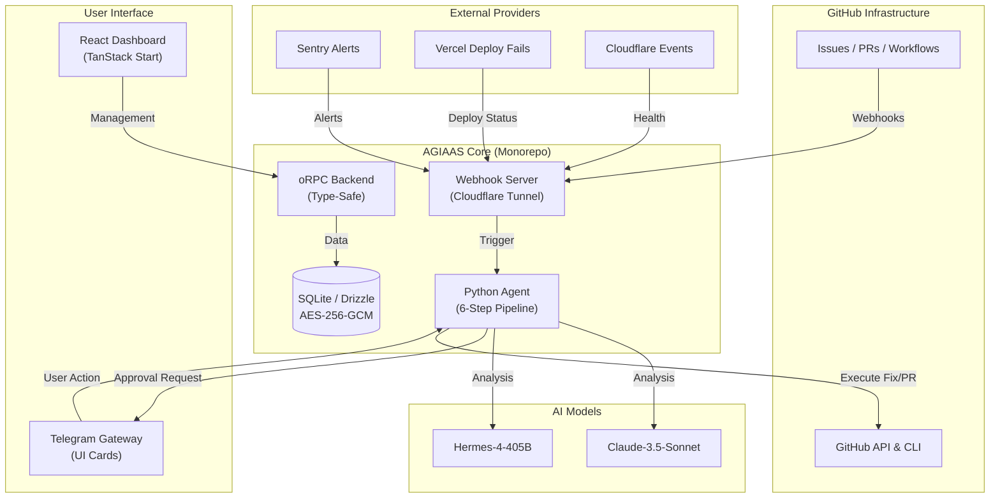

<p align="center">
  
</p>

<h1 align="center">🦊 AGIAAS — Autonomous Agent Platform</h1>

<p align="center">
  <strong>Your AI-powered on-call engineer that never sleeps.</strong>
</p>

<p align="center">
  <a href="https://opensource.org/licenses/MIT"></a>
  <a href="#-tech-stack"></a>
  <a href="#"></a>
  <a href="#-tech-stack"></a>
  <a href="#-tech-stack"></a>
</p>

<p align="center">
  <a href="#-how-it-works">How It Works</a> · <a href="#-key-features">Features</a> · <a href="#-quick-start">Quick Start</a> · <a href="#-architecture">Architecture</a> · <a href="#-project-structure">Structure</a>
</p>

---

## 💡 What is AGIAAS?

**AGIAAS** (Autonomous GitHub Incident Analysis & Automation System) is an intelligent agent platform that monitors your GitHub infrastructure, analyzes anomalies using state-of-the-art AI, and facilitates automated fixes via a **Telegram-integrated human-in-the-loop** workflow.

> Think of it as an on-call SRE that watches your repos 24/7 — triages incidents, writes patches, opens PRs, and waits for your approval before merging. All from your phone.

---

## 🧠 How It Works

When an incident hits your infrastructure, AGIAAS runs a **6-step autonomous pipeline**:

```
┌────────────────────────────────────────────────────────────────────┐
│                    AGIAAS ON-CALL PIPELINE                        │
├────────────────────────────────────────────────────────────────────┤
│                                                                    │
│  ① MONITOR        GitHub webhook fires (issue, PR fail, CI error) │
│       ↓                                                            │
│  ② REASON         Mixture-of-Agents debate for root-cause analysis│
│       ↓                                                            │
│  ③ RESEARCH       Web search + session history for context        │
│       ↓                                                            │
│  ④ REMEDIATE      Parallel task execution (patch, restart, cache) │
│       ↓                                                            │
│  ⑤ REPORT         Telegram UI Card with diff, cost, and actions   │
│       ↓                                                            │
│  ⑥ LEARN          Auto-generated runbook for future incidents     │
│                                                                    │
└────────────────────────────────────────────────────────────────────┘
```

**You stay in control**: Every proposed fix is sent to Telegram for your explicit approval before any code is merged.

---

## 🚀 Key Features

### Incident Intelligence
- **🎯 Proactive Monitoring** — Real-time tracking of GitHub Issues, PRs, and Workflow failures via webhooks
- **🧠 Mixture-of-Agents Debate** — Multi-agent reasoning for deep root-cause analysis
- **🔀 Dynamic Model Selection** — Choose AI models per-repo from the dashboard (Hermes-4-405B, Claude-3.5-Sonnet, Gemini Flash) with 3-tier priority: Project → Global → Auto-detect
- **🔍 Contextual Research** — Combines web search with historical session data to inform diagnostic decisions
- **📓 Auto Runbook Generation** — Every resolved incident produces a structured runbook to prevent recurrence

### Automation & DevOps
- **🛠️ Autonomous Patching** — Branch creation, code patching, and PR generation without human intervention
- **⏪ CI/CD Rollback** — One-tap rollback to the last successful workflow run
- **📡 Zero-Config Webhooks** — Auto-provisions Cloudflare tunnels and syncs GitHub webhook URLs automatically
- **🔄 Multi-Provider Webhooks** — GitHub, Sentry, Vercel, and Cloudflare event ingestion

### Security & Observability
- **📱 Human-in-the-Loop** — Interactive Telegram approval flow (✅ Approve / ❌ Reject / 💬 Re-Analyze)
- **🔐 AES-256-GCM Encryption** — All tokens and webhook secrets encrypted at rest
- **💰 Real-Time Cost Tracking** — Dynamic token usage and model cost calculation per incident
- **📋 Full Audit Trail** — Every AI suggestion, shell command, and token cost is logged

---

## 🔄 Architecture



---

## 🔌 Project Structure

This is a monorepo powered by **Turborepo** and **pnpm**.

| Package | Path | Description |
| :--- | :--- | :--- |
| **`@agiaas/agent`** | `packages/agent` | Python-based AI agent with 6-step incident pipeline |
| **`@agiaas/webhook-server`** | `packages/webhook-server` | Cloudflare tunnel + webhook ingestion & auto-sync |
| **`@agiaas/web`** | `apps/web` | React dashboard (TanStack Start + Tailwind CSS) |
| **`@agiaas/docs`** | `apps/docs` | Documentation site (Fumadocs + TanStack Start) |
| **`@agiaas/api`** | `packages/api` | Type-safe backend API (oRPC + Hono) |
| **`@agiaas/db`** | `packages/db` | Database schema & migrations (Drizzle ORM + SQLite) |
| **`@agiaas/auth`** | `packages/auth` | Authentication (better-auth) |
| **`@agiaas/ui`** | `packages/ui` | Shared UI components (Radix UI + Tailwind) |
| **`@agiaas/env`** | `packages/env` | Zod-validated environment variable management |
| **`@agiaas/config`** | `packages/config` | Shared TypeScript, ESLint, and Biome configurations |

---

## 🛠️ Tech Stack

| Layer | Technology |
| :--- | :--- |
| **AI Models** | Hermes-4-405B (Nous Research) · Claude-3.5-Sonnet (OpenRouter) · Gemini Flash — **per-repo configurable** |
| **Agent Engine** | Custom Python agent with Mixture-of-Agents reasoning + dynamic model routing |
| **Frontend** | TanStack Start + Tailwind CSS + Radix UI + WebGL (ASCIIText) |
| **Backend API** | oRPC (end-to-end type safety) + Hono |
| **Database** | SQLite + Drizzle ORM + AES-256-GCM encrypted secrets |
| **Authentication** | better-auth (session-based) |
| **Messaging** | python-telegram-bot (structured UI Cards) |
| **Infrastructure** | Docker Compose, Cloudflare Tunnels (auto-provisioned) |
| **Monorepo** | Turborepo + pnpm workspaces |
| **Code Quality** | Biome (lint + format) + TypeScript strict mode |

---

## 🚀 Quick Start

### Prerequisites

- **Runtimes:** Node.js 18+, Python 3.12+
- **Tools:** `pnpm`, `gh` (GitHub CLI), `sqlite3`, `cloudflared`
- **Accounts:** GitHub access, Telegram Bot (via [@BotFather](https://t.me/BotFather))

### Option A — Docker (Recommended)

```bash
git clone https://github.com/mehmetkr-31/agiaas.git
cd agiaas
pnpm install
pnpm setup        # Interactive — generates security keys & .env
docker-compose up --build
```

> **Dashboard** → `http://localhost:3678`
> **Agent API** → `http://localhost:8678`

### Option B — Local Development

```bash
git clone https://github.com/mehmetkr-31/agiaas.git
cd agiaas
pnpm install
pnpm setup        # Interactive — generates security keys & .env
pnpm db:migrate   # Initialize SQLite database
pnpm python:install  # Set up Python venv for the agent
pnpm dev          # Start all services in parallel
```

> **Dashboard** → `http://localhost:3678`
> **Agent API** → `http://localhost:8678`

---

## 🔑 Environment Variables

Create a `.env` file in the project root (or use `pnpm setup` to generate one interactively).

| Variable | Required | Description |
| :--- | :--- | :--- |
| `DB_ENCRYPTION_KEY` | ✅ | 32-character key for AES-256-GCM secret encryption |
| `BETTER_AUTH_SECRET` | ✅ | 32+ character key for session management |
| `NOUS_API_KEY` | ✅* | Nous Research API key (or use `OPENROUTER_API_KEY`) |
| `OPENROUTER_API_KEY` | ✅* | OpenRouter API key (or use `NOUS_API_KEY`) |
| `GITHUB_TOKEN` | ✅ | PAT with `repo` and `workflow` scopes |
| `GITHUB_USERNAME` | ✅ | Your GitHub username |
| `TELEGRAM_BOT_TOKEN` | 📱 | From [@BotFather](https://t.me/BotFather) |
| `TELEGRAM_CHAT_ID` | 📱 | Your personal chat ID |
| `WEBHOOK_PORT` | No | Webhook receiver port (default: `8678`) |
| `PORT` | No | Dashboard port (default: `3678`) |

> *At least one AI provider key is required.

---

## 📱 Telegram Workflow

AGIAAS sends structured **UI Cards** to Telegram with rich formatting:

```
┌──────────────────────────────────────┐
│ ⚠️ INCIDENT DETECTED                │
│ ──────────────────────               │
│ 📂 Repo: your-org/your-repo         │
│                                      │
│ 💬 Response:                         │
│ CI pipeline failed on main branch.   │
│ Root cause: missing env variable     │
│ STRIPE_KEY in deployment config.     │
│                                      │
│ ──────────────────────               │
│ 💰 Cost: $0.0142  |  ⚡ Tokens: 3,847│
└──────────────────────────────────────┘

  ✅ Approve   ❌ Reject   💬 Re-Analyze
```

---

## 🤖 Security & Principles

1. **Explicit Approval** — No code is modified or pushed without a direct "Approve" from Telegram.
2. **Minimal Footprint** — Agents operate in isolated `.tmp` directories with no persistent disk access.
3. **Encrypted Secrets** — All tokens and webhook secrets stored with **AES-256-GCM** encryption.
4. **Audit Logs** — Every AI suggestion, command execution, and token cost is logged with timestamps.

---

## 📊 Cost Tracking

AGIAAS provides real-time financial tracking for AI operations:
- **Per-incident cost breakdown** — Input/output tokens × model pricing
- **Dynamic pricing** — Fetched from OpenRouter model metadata
- **Budget alerts** — Set `AI_BUDGET_LIMIT` to receive Telegram notifications when daily spend exceeds threshold

> [!TIP]
> Use lighter models (Hermes-4-405B, Gemini Flash) for initial triage and reserve Claude-3.5-Sonnet for complex root-cause analysis to optimize costs.

---

## 🪟 Windows Users

- **Inside Docker**: All `apt-get` commands in Dockerfiles run inside Linux containers — fully compatible via Docker Desktop.
- **Line Endings**: If you encounter `\r: command not found`, ensure your IDE saves files with **LF** line endings.
- **Paths**: `pnpm setup` automatically detects Windows paths for GitHub credentials.

---

## 📖 Documentation

Full documentation is available in the `apps/docs` package, built with [Fumadocs](https://fumadocs.vercel.app/):

- [Installation Guide](apps/docs/content/docs/getting-started/installation.mdx)
- [Configuration Reference](apps/docs/content/docs/getting-started/configuration.mdx)
- [Architecture Deep Dive](apps/docs/content/docs/architecture.mdx)
- [Webhook Integrations](apps/docs/content/docs/features/webhooks.mdx)
- [Telegram Bridge](apps/docs/content/docs/features/telegram.mdx)
- [Cost Management](apps/docs/content/docs/ops/costs.mdx)

---

## 📝 License

Distributed under the **MIT License**. See `LICENSE` for more information.

---

<p align="center">
  Built with ❤️ by the <a href="https://github.com/mehmetkr-31">AGIAAS Team</a>
</p>
