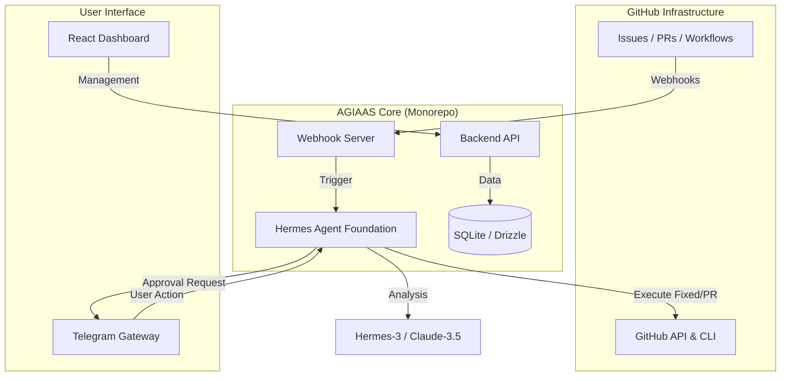

# Architecture

AGIAAS is built as a modular monorepo, with its primary intelligence powered by the [Hermes Agent](https://hermes-agent.nousresearch.com/docs/) core.

## High-Level Flow

The following diagram illustrates how an event on GitHub flows through the AGIAAS infrastructure, triggering the autonomous [Hermes Agent](https://hermes-agent.nousresearch.com/docs/).

## Layer Breakdown

### 📡 Monitoring Layer (`@agiaas/webhook-server`)
The gateway for all GitHub events. It uses **Cloudflare Tunnels** to receive webhooks and synchronizes them with the Hermes Agent.

### 🧠 Hermes Brain Layer (`@agiaas/agent`)
The core intelligence layer. This is a specialized implementation of the [Hermes Agent](https://hermes-agent.nousresearch.com/docs/) that uses **Long-Context LLMs** to:
1. Parse error logs and issue descriptions using the Hermes coding skills.
2. Search the codebase for relevant files via the Hermes filesystem tools.
3. Propose and test code patches autonomously.

### 💼 Management Layer (`@agiaas/web` & `@agiaas/api`)
The administrative hub designed to manage your Hermes instances.
- **API**: A type-safe **oRPC** backend.
- **Dashboard**: A React application for monitoring agent performance and the [learning loop](https://hermes-agent.nousresearch.com/docs/).

### 📱 Messaging Gateway (Telegram)
Inspired by the [Hermes Messaging Gateway](https://hermes-agent.nousresearch.com/docs/user-guide/messaging), this provides a secure, mobile-friendly interface for engineers to approve or reject agent actions.

## Technology Stack

AGIAAS leverages the modern stack recommended by **Nous Research**:

- **Agent Engine**: [Hermes Agent (Python)](https://hermes-agent.nousresearch.com/docs/).
- **AI Models**: Hermes-3, Claude-3.5-Sonnet (optimized for Hermes tool-calling).
- **Messaging**: Integrated Telegram bridge.
- **Database**: SQLite with Drizzle ORM.
- **Frontend**: TanStack Start & Tailwind CSS.
